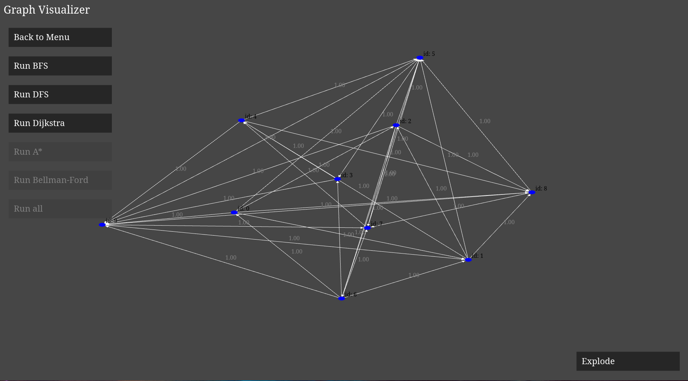

# Graph Visualizer

Graph Visualizer is a browser-based tool for visualizing directed and undirected graphs, featuring interactive traversal algorithms using WebGL and Emscripten. Try it out with the [demo](https://milosz275.github.io/graph-visualizer/demo).

## Table of Contents

- [Features](#features)
- [Structure](#structure)
- [Design Patterns](#design-patterns)
- [Acknowledgements](#acknowledgements)
- [License](#license)

## Features

- Create graphs in polygonal shapes or generate random graphs.
- Visualize graph traversal using BFS, DFS, and Dijkstra's algorithm.
- Step-by-step execution with one-second intervals.
- Interactive UI with WebGL rendering.

## Structure

The project uses the [web-ui](https://github.com/milosz275/web-ui) frontend framework for rendering. It follows the Model-View-Controller (MVC) architecture to separate concerns effectively.

## Design Patterns

Graph Visualizer is a highly abstracted project that leverages multiple design patterns, with MVC as the primary architectural pattern.

### Creational Patterns

- Singleton – Ensures only one instance of the Graph App exists.
- Abstract Factory – Used for UI elements such as labels and buttons, allowing flexible UI customization.

### Structural Patterns

- Facade – Simplifies interactions with the web framework and user input.
- Proxy – Handles input callbacks efficiently.
- Composite – Groups nodes into graph structures.

### Behavioral Patterns

- State Pattern – Manages different states of the program and executes appropriate behavior.
- Visitor Pattern – Allows traversal algorithms to operate on graph nodes without modifying their structure.

## Acknowledgements

- [Project icon](https://www.svgrepo.com/svg/451006/knowledge-graph)

## License

This project is licensed under the MIT License - see the [LICENSE](https://github.com/milosz275/graph-visualizer/blob/main/LICENSE) file for details.
